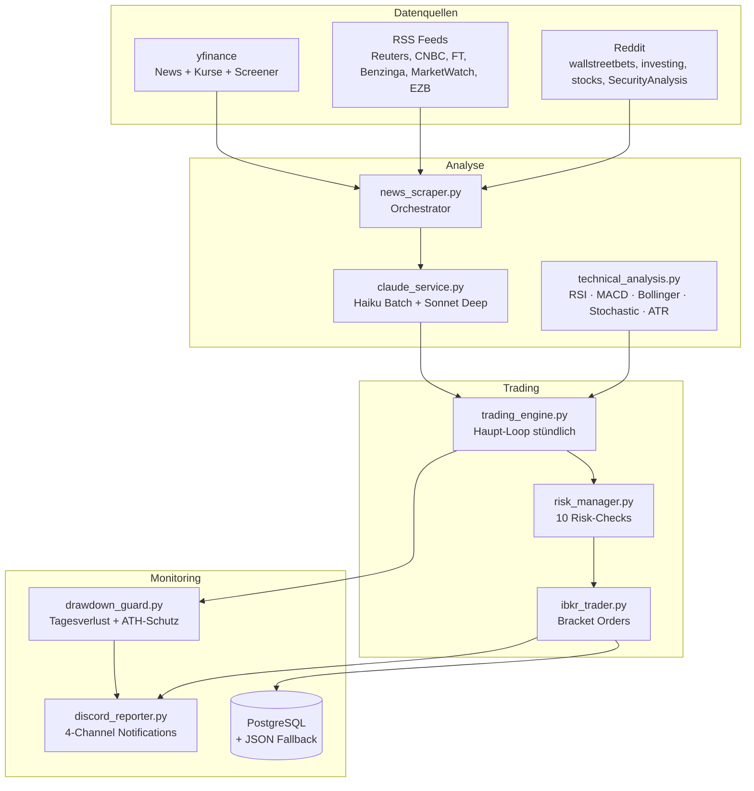
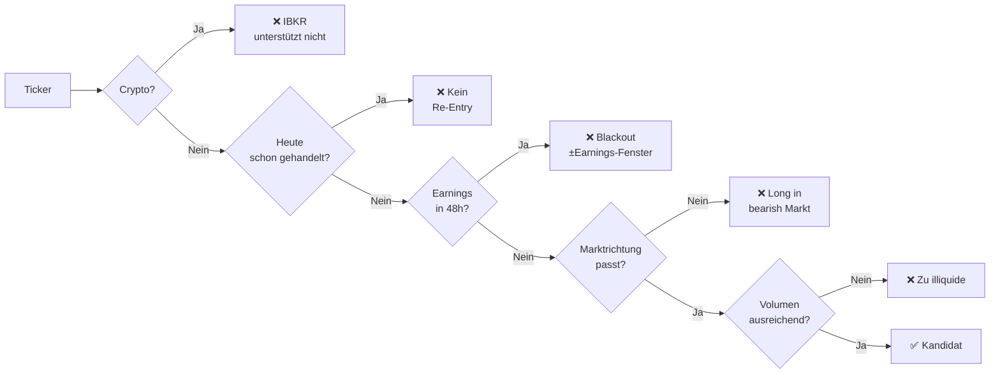

# Finanz-Bot

Ein vollautomatischer Intraday-Trading-Bot auf Basis von Claude AI und Interactive Brokers (IBKR).
Er analysiert täglich bis zu 188 Ticker, filtert nach Marktlage und führt Trades im Paper- oder Live-Modus aus — alles ohne manuellen Eingriff.

---

## Architektur

Das System besteht aus vier Schichten: Daten sammeln → analysieren → handeln → überwachen.



---

## Ticker-Universum

Der Bot analysiert täglich **188 feste Ticker** plus bis zu **10 dynamische Trending-Ticker**.

| Markt | Anzahl | Beispiele |
|---|---|---|
| US | 45 | AAPL, MSFT, GOOGL, JPM, WMT |
| Deutschland | 18 | SAP.DE, BMW.DE, Siemens.DE, Allianz.DE |
| Europa | 17 | ASML.AS, Airbus AIR.PA, Nestlé NESN.SW |
| ETFs | 8 | SPY, QQQ, DIA, IWM, GLD, TLT |
| Leveraged ETFs | 4 | SSO, QLD, DDM, UWM (optional, per `.env` deaktivierbar) |
| Crypto | variabel | BTC-USD, ETH-USD (optional, per `.env` deaktivierbar) |
| Trending (dynamisch) | bis 10 | via yfinance Screener: most_actives, day_gainers, growth_tech |

---

## Tagesablauf & Zeitplan

Der Bot läuft Montag–Freitag nach einem festen Zeitplan. Alle Zeiten in **UTC+1 (Deutschland)**.

```mermaid
gantt
    title Finanz-Bot Tagesablauf
    dateFormat HH:mm
    axisFormat %H:%M

    section Analyse
    EU-Batch (Haiku)       :07:00, 60m
    US-Batch (Haiku)       :08:00, 30m
    Deep Analysis (Sonnet) :08:30, 15m

    section Berichte
    Morning Report Discord :08:45, 5m
    Morning Checks         :09:00, 10m
    Evening Report Discord :21:45, 5m

    section Trading
    Stündlicher Trade-Cycle :09:00, 750m
    Midday Refresh         :14:00, 30m
    Positionen schließen   :21:30, 10m
```



### Was in jeder Phase passiert

**07:00 — EU-Analyse**
Alle deutschen und europäischen Ticker werden zusammen mit EU-Newsfeeds (Reuters, FT, EZB) an Claude Haiku geschickt. Haiku bewertet jeden Ticker und gibt einen Confidence-Score (1–10) sowie eine Handelsrichtung zurück. Ergebnis: `analysis.json` mit 160 Ticker.

**08:00 — US-Analyse**
Dasselbe für US-Ticker und ETFs mit amerikanischen Feeds (CNBC, Benzinga, Yahoo). Ergebnis wird in `analysis.json` gemergt → 188 Ticker total.

**08:30 — Deep Analysis**
Die Top-3 Ticker (Confidence ≥ 7) werden nochmal tiefer mit Claude Sonnet analysiert. Sonnet liefert zusätzlich: Entry-Zone, konkretes Price-Target, Stop-Loss-Empfehlung und Makro-Kontext (Fed, Earnings-Umfeld, Sektor-Dynamik).

**08:45 — Morning Report**
Discord `#morning` bekommt eine Zusammenfassung: aktuelle Marktlage (VIX, SPY-Trend), die Top-Picks aus der Deep Analysis und die aktuelle Earnings-Blacklist.

**09:00 — Morning Checks**
Einmalig täglich: VIX laden und Modus bestimmen, SPY-Trend berechnen, Earnings-Blacklist für alle 188 Ticker aktualisieren. Ergebnisse landen in JSON-Dateien und gelten für den ganzen Tag.

**09:00–21:30 — Stündlicher Trading-Cycle**
Kern des Bots — wird jede Stunde ausgeführt. Details siehe [Trading-Logik](#trading-logik).

**14:00 — Midday Refresh**
Die Morning-Analysen sind inzwischen 6–7 Stunden alt. Die Top-10 Ticker nach aktuellem Handelsvolumen werden nochmal frisch mit Haiku analysiert und `analysis.json` wird aktualisiert.

**21:30 — End-of-Day Liquidation**
Daytrading-Regel: Keine Positionen über Nacht. Alle offenen Bracket Orders werden gecancelt, alle Positionen zu Marktpreis liquidiert.

**21:45 — Evening Report**
Discord `#evening` bekommt den Tagesabschluss: Tages-PnL, Win-Rate, Claude Accuracy (wie oft lagen die Signale richtig?), API-Kosten und 7-Tage-Trend.

---

## Datenquellen

| Quelle | Was | Kosten |
|---|---|---|
| yfinance News | 5 aktuelle News pro Ticker | Kostenlos |
| yfinance OHLCV | Stundenkurse (7 Tage) für technische Analyse | Kostenlos |
| yfinance Screener | Trending Ticker (most_actives, day_gainers) | Kostenlos |
| RSS Feeds (6) | 20–40 Artikel/Tag von Reuters, CNBC, FT, Benzinga, MarketWatch, EZB | Kostenlos |
| Reddit (4 Subreddits) | Trending-Erwähnungen, Sentiment | Kostenlos |
| Claude Haiku | Batch-Analyse aller 188 Ticker | ~$0.05–0.10/Tag |
| Claude Sonnet | Deep Analysis Top-3 | ~$0.02/Tag |
| VIX via yfinance | Markt-Volatilitätsmodus | Kostenlos |
| SPY 20-EMA | Marktrichtung | Kostenlos |

**Gesamt API-Kosten: ~$0.07–0.12/Tag** — hauptsächlich Claude-Kosten.

---

## Trading-Logik

### Schritt 1: Signale kombinieren

Für jeden Ticker liegen am Ende des Morgens drei Informationsquellen vor:

- **`technical_signals.json`** — RSI, MACD, Bollinger Bands, Stochastic, ATR → kombiniertes TA-Signal (`strong_long`, `long`, `neutral`, `short`, `strong_short`)
- **`analysis.json`** — Claude Haiku: Sentiment + Confidence-Score (1–10) + Handelsrichtung
- **`deep_analysis.json`** — Claude Sonnet (nur Top-3): Entry-Zone, Price-Target, Stop-Loss

Das TA-Signal bestimmt die **Richtung** (long/short), der Claude-Score bestimmt die **Überzeugung**.

### Schritt 2: 5-stufiger Kandidaten-Filter

Jeder Ticker läuft durch fünf Filter — alle müssen grün sein:



**Filter 1 — Krypto-Blockade:** IBKR-Contracts unterstützen Crypto-Ticker nicht.

**Filter 2 — Kein Re-Entry:** Wurde der Ticker heute bereits gehandelt (auch wenn per SL/TP geschlossen), kommt er nicht nochmal dran. Verhindert Overtrading.

**Filter 3 — Earnings-Blackout:** 48 Stunden vor und 24 Stunden nach einem Earnings-Termin ist der Ticker gesperrt. Earnings können ±10–20% Intraday-Bewegung erzeugen — das Risiko ist nicht kalkulierbar.

**Filter 4 — Marktrichtung (SPY 20-EMA):**

| SPY vs. EMA20 | Trend | Erlaubt |
|---|---|---|
| > +0.3% darüber | bullish | nur Long-Trades |
| < -0.3% darunter | bearish | nur Short-Trades |
| dazwischen | neutral | beide Richtungen |

Hintergrund: ~70% aller Aktien korrelieren mit dem Gesamtmarkt. Ein Long-Trade in einem bearish Markt hat historisch deutlich schlechtere Trefferquote.

**Filter 5 — Volumen:**

| Typ | Minimum | Bonus |
|---|---|---|
| Aktie | 500.000 Stücke/Tag | |
| ETF | 1.000.000 Stücke/Tag | |
| Volumen-Spike | Vol > 150% des 20-Tage-Schnitts | +1 Confidence |

Zu geringe Liquidität führt zu schlechten Spreads und hohem Slippage beim Stop-Loss.

### Schritt 3: Confidence-Anpassung

Der Haiku-Score wird noch dynamisch angepasst:

```
Basis:              Claude Haiku Confidence (1–10)
+ Stochastic-Boost: %K im Signal-Band, bestätigt Richtung → +1
- Stochastic-Strafe: %K läuft gegen Signal → -1
+ Volumen-Spike:    Vol > 150% des Schnitts → +1

Ergebnis: max(1, min(10, angepasster Score))
```

### Schritt 4: Priorität-Sortierung (nur Live-Modus)

Im Live-Modus werden pro Stunde maximal **2 Trades** ausgeführt. Kandidaten werden nach Priorität sortiert:

| Score | Bedingung | Beschreibung |
|---|---|---|
| P1 (Score 2) | `strong_long/short` + Claude bullish/bearish + Confidence ≥ 7 | Stärkstes Signal |
| P2 (Score 1) | `long/short` + Claude + Confidence ≥ 6 | Klares Signal |
| Kein Score | Alles andere | Überspringen |

Bei gleicher Priorität gewinnt der höhere Confidence-Score. Nur die Top-2 werden weiter geprüft.

Im Paper-Modus gibt es dieses Limit nicht — alle passenden Signale werden ausgeführt, um mehr Daten für spätere Auswertung zu sammeln.

### Schritt 5: Live-Signal-Filter

Im Live-Modus werden zusätzlich `plain long/short`-Signale herausgefiltert — nur `strong_long` und `strong_short` kommen durch. Hintergrund: Backtests zeigen 59% Win-Rate bei `strong_long` vs. 50% bei `plain long` — nur `strong` hat einen messbaren Edge bei kleinem Kapital.

---

## Market Filters

### VIX-Modus

Der VIX misst die implizite Marktvolatilität. Der Bot passt seine Aggressivität automatisch an:

| VIX | Modus | Min. Confidence | Positionsgröße | Shorts |
|---|---|---|---|---|
| < 25 | normal | 6 | 100% | ✅ |
| 25–35 | cautious | 7 | 50% | ❌ |
| 35–45 | etf_only | 7 | 50%, nur ETFs | ❌ |
| > 45 | paused | — | 0% (kein Trading) | ❌ |

Historischer Kontext: VIX-Schnitt liegt bei ~20. Ab 25 ist der Markt bereits unter Stress.

### SPY 20-EMA (Marktrichtung)

Der Bot berechnet täglich morgens die 20-Tage-EMA des SPY ETF und vergleicht den aktuellen Kurs:

```
distance = (SPY_aktuell - EMA20) / EMA20 × 100

+0.3% oder mehr über EMA20  → bullish  → nur Longs
-0.3% oder mehr unter EMA20 → bearish  → nur Shorts
dazwischen                  → neutral  → beide
```

Der ±0.3%-Puffer verhindert, dass der Bot bei kleinen Schwankungen um den EMA herum ständig zwischen bullish und bearish wechselt.

### Earnings-Blacklist

```
Quelle:  yfinance.Ticker().calendar (Daten von SEC/EDGAR)
Fenster: 48h VOR + 24h NACH dem Earnings-Termin
Update:  Täglich um 09:00 Uhr
Timeout: 10 Sekunden pro Ticker

Beispiel:
  Apple meldet Donnerstag 16:30 Uhr
  Blacklist-Fenster: Dienstag 16:30 → Freitag 16:30
```

---

## Risk Management

Bevor ein Trade ausgeführt wird, müssen **alle 10 Checks** grün sein:

| # | Check | Bedingung |
|---|---|---|
| 1 | Mindestpreis | Kurs ≥ 5,00 € (keine Penny Stocks) |
| 2 | Kommission | Trade-Volumen ≥ 50 € (damit 1 € Kommission max 2% kostet) |
| 3 | Kleines Kapital | Kapital < 200 € → max. 1 Position gleichzeitig |
| 4 | Confidence | Score ≥ 6 allgemein, ≥ 5 für ETFs |
| 5 | Tagesverlust | Portfolio nicht > 5% unter Tagesstart |
| 6 | Positions-Limit | Offene Positionen < MAX_POSITIONS |
| 7 | Portfolio-Exposure | Nicht mehr als 80% des Portfolios investiert |
| 8 | Kein Duplikat | Ticker läuft nicht bereits als offene Position |
| 9 | R/R-Ratio | Take-Profit-Distanz ≥ 2,5× Stop-Loss-Distanz |
| 10 | Margin | Available Funds ≥ (Position-Wert / Hebel) × 1,1 |

### Position Sizing

Die Positionsgröße hängt vom Confidence-Score ab:

| Confidence | Portfolio-Anteil | Mit 5× Hebel (Live) |
|---|---|---|
| 6–7 | 5% | 25% Nominal |
| 8 | 6,5% | 32,5% Nominal |
| 9–10 | 8% | 40% Nominal |

### Drawdown-Guard

Zwei automatische Sicherheitsschalter stoppen den Bot bei zu hohen Verlusten:

- **Tagesverlust ≥ 15%** → alle Positionen sofort schließen, Trading für heute gestoppt
- **Drawdown vom Allzeithoch ≥ 20%** → alle Positionen schließen + **3-Tage-Pause**

---

## Paper vs. Live

| Einstellung | Paper | Live |
|---|---|---|
| Portfolio | $1.000.000 (simuliert via IBKR Paper) | echtes Kapital |
| Hebel | 1× | 5× (CFD via IBKR) |
| Max. Positionen | 10 (konfigurierbar) | fest 2 |
| Stop-Loss | 3% (konfigurierbar) | fest 2% |
| Take-Profit | 7,5% (konfigurierbar) | fest 4% |
| Signal-Filter | `any` (long + strong_long) | nur `strong_long/short` |
| Tagesverlust-Limit | 5% | 10% |
| Fehler bei Config | Warning | `sys.exit()` — kein Start ohne valide Config |

!!! warning "Live-Modus"
    Der Live-Modus ist restriktiver konfiguriert und lässt sich nicht per `.env` aufweichen (SL/TP sind hardcodiert). Das ist Absicht — bei echtem Kapital gibt es keinen Spielraum für Konfigurationsfehler.

---

## Notifications (Discord)

Der Bot kommuniziert über vier dedizierte Discord-Channels:

| Channel | Was | Wann |
|---|---|---|
| `#morning` | Marktlage, VIX-Modus, Top Picks, Earnings-Blacklist | 08:45 täglich |
| `#trade-log` | Jede Order + stündliches Status-Update (offene Positionen, P&L) | sofort + stündlich |
| `#alerts` | Fehler, Crashes, IBKR-Verbindungsprobleme, ungesicherte Positionen | sofort |
| `#evening` | Tages-PnL, Win-Rate, Claude-Accuracy, API-Kosten, 7-Tage-Trend | 21:45 täglich |

---

## Datenhaltung

### JSON-Dateien (immer aktiv)

Alle kritischen Daten werden in `data/` als JSON gespeichert. Das ist die primäre Datenhaltung — auch wenn PostgreSQL läuft, dienen die JSON-Dateien als Backup.

| Datei | Inhalt |
|---|---|
| `analysis.json` | Haiku-Ergebnisse für alle 188 Ticker |
| `deep_analysis.json` | Sonnet-Ergebnisse für Top-3 (Entry-Zone, Price-Target) |
| `technical_signals.json` | TA-Signale pro Ticker (RSI, MACD, BB, Stochastic, ATR) |
| `pnl_log.json` | Offene + geschlossene Trades mit allen Eintrags-Details |
| `trade_log.json` | Vollständiges Log jeder Order |
| `vix_status.json` | Aktueller VIX-Wert + Modus |
| `market_trend.json` | SPY-Kurs, 20-EMA, Trend-Richtung |
| `earnings_blacklist.json` | Alle gesperrten Ticker + Fenster |
| `engine_state.json` | Tagesstartwert, heute gehandelte Ticker, Trailing Stops, Pause-Status |
| `api_costs.json` | Kosten jedes Claude-API-Calls |

### PostgreSQL (optional)

Wenn `DB_HOST`, `DB_PORT`, `DB_NAME` und `DB_USER` in der `.env` gesetzt sind, schreibt der Bot zusätzlich in eine PostgreSQL-Datenbank. Ist die Datenbank nicht erreichbar, läuft der Bot ohne Fehlermeldung weiter — nur JSON-Fallback.

Die Datenbank ermöglicht historische Auswertungen:

| Tabelle | Inhalt |
|---|---|
| `claude_analyses` | Alle Claude-Aufrufe mit Tokens, Cache-Hits, Kosten |
| `trade_decisions` | Jede Trade-Entscheidung inkl. aller 10 Risk-Check-Ergebnisse |
| `trades` | Vollständige Trade-History mit Entry, Exit, P&L |
| `daily_summary` | Tägliche Zusammenfassung: PnL, Win-Rate, Claude-Accuracy, API-Kosten |
| `api_costs` | Granulare API-Kostenhistorie |

---

## Konfiguration (.env)

```bash
# Handelsmodus
TRADING_MODE=paper              # paper | live
MAX_POSITIONS=10                # Paper-Default; Live wird automatisch auf 2 gedeckelt

# Risk-Parameter (nur Paper; Live hat fixe Werte)
STOP_LOSS_PCT=0.03              # 3%
TAKE_PROFIT_PCT=0.075           # 7,5%
MAX_POSITION_SIZE_PCT=0.08      # 8% Portfolio max pro Position
MAX_DAILY_LOSS_PCT=0.05         # 5% Tagesverlust-Limit

# Signal-Qualität
MIN_CONFIDENCE_SCORE=6
LIVE_REQUIRED_TA_SIGNAL_STRENGTH=strong   # strong | any
MIN_STOCK_PRICE=5.0
MIN_RR_RATIO=2.5

# Trailing Stop
USE_TRAILING_STOP=true
TRAILING_STOP_ATR_MULTIPLIER=1.5

# Ticker-Universum
EXCLUDE_CRYPTO=true
EXCLUDE_LEVERAGED_ETFS=true

# IBKR
IBKR_HOST=172.18.0.2
IBKR_PORT=4004
IBKR_CLIENT_ID=1
IBKR_USERNAME=                  # Nur für Live-Modus nötig

# Claude
ANTHROPIC_API_KEY=sk-...
CLAUDE_HAIKU_MODEL=claude-haiku-4-5-20251001
CLAUDE_SONNET_MODEL=claude-sonnet-4-6

# Discord Webhooks
DISCORD_MORNING_CHANNEL=https://discord.com/api/webhooks/...
DISCORD_ALERTS_CHANNEL=...
DISCORD_TRADE_LOG_CHANNEL=...
DISCORD_EVENING_CHANNEL=...

# PostgreSQL (optional)
DB_HOST=localhost
DB_PORT=5432
DB_NAME=finanzbot
DB_USER=finanzbot
DB_PASSWORD=...
```

---

## Wichtige Schwellwerte auf einen Blick

| Parameter | Wert |
|---|---|
| VIX-Grenzen | 25 / 35 / 45 |
| SPY-EMA-Periode | 20 Tage |
| SPY-Puffer | ±0.3% |
| Earnings-Blackout | 48h vor / 24h nach |
| Min. Volumen Aktie | 500.000 Stücke/Tag |
| Min. Volumen ETF | 1.000.000 Stücke/Tag |
| Volumen-Spike | > 150% des 20d-Schnitts |
| RSI-Periode | 14 |
| MACD | 12 / 26 / 9 |
| Bollinger Bands | 20 Perioden, 2× Stdabw |
| ATR-Spike-Schwelle | > 150% des 20d-ATR |
| Tagesverlust-Limit | 15% |
| ATH-Drawdown-Limit | 20% (→ 3-Tage-Pause) |
| Portfolio-Exposure max | 80% |
| Kommission (IBKR) | 1 € Minimum |
